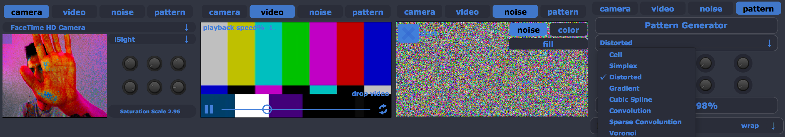

Interface
============

Ina video app interface is divided between the static and the volatile modules. The picture below shows the static part of the GUI.
When the application is launched, this is what the user will see. It is composed by the Video Mixer, the main Modules on the right, and on
the left we have the Information menus, Recording, and the Sampler Modules. This part of the software is not customizable in the graphical 
presentation domain, even though the user is completely free to make connections between modules. The parts of the interface not mentioned in this chapter, 
most probably will have a chapter on their own.

.. image:: images/interface.png
    :align: center

Video Mixer
-------------------------------

The Video Mixer is where all the signals should flow. It has 8 channels and 12 pre-installed effects that run entirelly on the GPU 
for video processing. Some effects have features that the user can control and will be triggered for a better user experience. 
Parameters such as Sine and Cosine of a processing effect are there for the user to be able to change accordingly. Plus it has an adaptable
dialog where it shows the values and the name of the parameter we are using/changing

.. image:: images/interface2.png
    :align: center

Main Modules
-------------------------------

The upper right part of Ina software has some built in functions that make the user interact with video in some different ways. The upper part
[Interface1], the Interpolator [Interpol], and the Drawing Interface [Interface2]. The first has the ability to connect external devices, run video files, 
generate noise, and generate patterns based on common known functions such as Convolution. It can also generate colors and the static functions can be used
for masking other video if the user wants.

Here I show some examples of the [Interface1] module that allows the user to connect external devices and libraries such as Blackmagic 4K (example with 
macbook pro built in camera) and control some parameters such HSL of the incomming feed. The video tab is a "drag-and-drop" module for external video files 
(one can control the playback speed also). The noise tab generates the common known pixel noise and also can fill the matrix with a specified color (Apple Color 
Picker popup). And the pattern tab has some built in functions of generated patterns used in video signal processing (VIZZIE influence in this one) with some knobs
for control. These are static controllable patterns.

The Interpolator is a built in effect that performs linear interpolation between incomming video. It is based on jit.plur with 16 types of interpolation with X_range
and Y_range controllable independently (knobs to the left). The colormode of this module can also be changed between 3 presets. 

The Drawing Interface will have a dedicated chapter. 

Sampler Modules
-------------------------------

The sampler is the middle row that has it's own routing engine and that allows the user to add as many modules as he wants and mix them together after going to the mixer.
It has two scroll bars, one for scrolling through the sampler and other to grab a module and to bring it upwards or downwards. This is clearly an influence by Kontakt and an engine for synthesis.
More information on the modules in the Synthesis tab.

Recorder
-------------------------------

The recorder allows the user to save a video of the mesh that is being generated called InaVideo.mov and an Image on the source folder. One can choose the codecs 
(preferable lossless) and the type of file. It is worth mentioning that Ina software has a built-in syphon server that allows the user to send it. Probably in the future
will have Spout too.

.. image:: images/interface7.png
    :align: center

This module also has important information on the computer usage (application %) and the Frame Rate alongside with the milisecond latency of the main video matrix.
