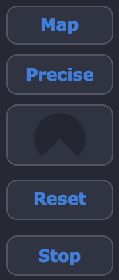
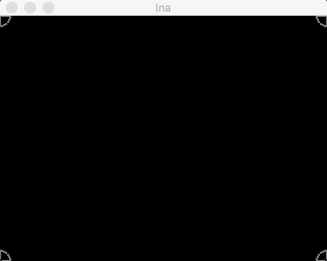
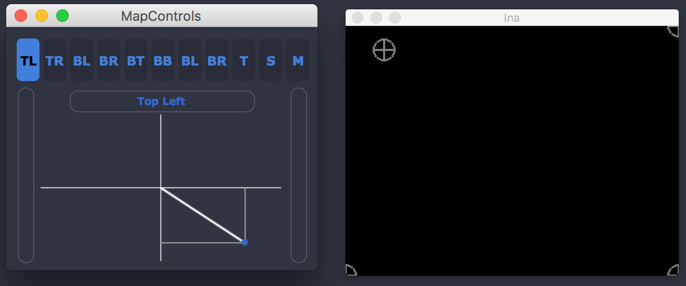

Mapping
============

Ina software allows you to project and warp a mesh of the video you are generating using the conventional video mapping techniques. The main interface of the 
projection mapping engine is at the right of the Video Mixer and has some features. 

The Map option allows the user to start controlling the projection through the corners (4 grey circles will appear after click) adding the warp possibility.
The reset option will get the mesh to the normal square with the default dimentions and the Stop will just erase the circles for grabbing and just leave the warped mesh.
The middle button with a knob allows the user to augment the circles for better grabbing and UX.

Precise Mapping
-------------------------

The second button (starting from top) triggers this hability. A dialog will appear with a interactive joystick. The user can control each individual corner in the 
X and Y axis with some precision. It is possible to grab singularly the corners, or by place (Both Top, Both Bottom, Both Right, Both Left) and some interesting features
such as Scale and Translate.

.. image:: images/interface23.png
    :align: center

