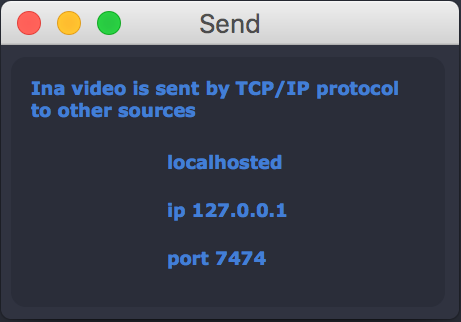

Menu Bar
================

* Ina
* About Ina
* Control
* OpenGL Status
* Shortcuts
* Stop/Render
* Network
* Send
* Syphon
* Window
* Help

The OpenGL Status window shows the user some shell information about the graphics on the hosted computer including GL Version and Renderer. 
This commands are optimized for MacOS so this version should not work functionally on Microsoft.

The Shortcut window gives the user information about the keyboard shortcuts of Ina and the ones that can be used. This should probably work cross-platform.

The Send and the Syphon embeded in the Network menu are about the networking of Ina's video. The send if using UDP protocol hosting it locally and using the port 7474.
The Syphon doesn't need setup, Ina created a server internally and the user just needs to plug in the Syphon Recorder.

