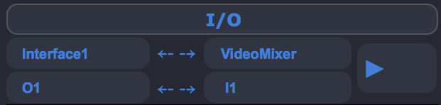
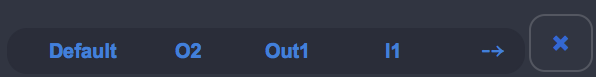

Signal Routing
==================

There are some things that the user should have in mind about signal routing in Ina software.

* There are always 8 ins and 8 outs as maximum
* There are no cables
* Sampler has a single routing before going to the mixer
* The main interface has the routing in the bottom right corner
* The sampler has the routing in the bottom right corner [of the sampler]

.. note:: There is no graphical presentation of the connections done. Soon there will be a popup in the menubar that will allow the user to know which connections he made since software startup.

Main IO
-------------

The main IO has always pre-built options (alongside with 8 Ins and Outs) for the main interface such as:

* Interface1 
* Interface2
* Interpol
* VideoMixer
* Sampler

For the connection to happen (in both connectors (Main and Sampler)) one has to click the arrow key to connect. 

Sampler IO
-------------

The sampler I/O is exactly the same as the other one but only happens inside the Sampler. Every module has a "-" button next to the "X"
and the user can get the ID of each module and route it to one or the other or to the main Sampler Outs[8].

