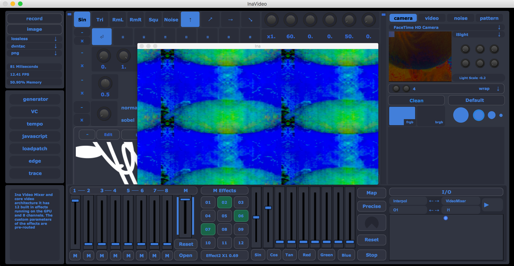

[Ina] Software Documentation
===============================

This is the official documentation of the Ina video synthesis 
and mapping sofware. It is a free standalone software and tool
that was developed to merge some features and tools that were 
found in other video softwares for a personal and/or commercial
use. Combining synthesis, drawing, and video mapping in one tool.
All of the features will be explained here and further development
will be documented as well. Test

.. toctree::

   interface.md
   synth.md
   draw.md
   map.md
   route.md
   menu.md

References
-------------------------------

* `VSynth <https://www.patreon.com/vsynth>`_
    Package of Analog Video Synthesis Emulation for MaxMSP
* `Lumen <https://lumen-app.com>`_
    Video Synthesis MacOS Standalone Software
* `VIZZIE <https://cycling74.com/articles/introducing-vizzie>`_
    Main MaxMSP Video Synthesis Package
* `Synesthesia <http://www.synesthesia.live>`_
    VJ tool for Visual Art Performance
* `MODULATE! <https://github.com/alexrodi>`_
    A similar approach dedicated to Audio Synthesis
* `MapMap <http://projection-mapping.org/tools/mapmap/>`_
    An Open Source Projection Mapping Software
* `VPT8 <https://hcgilje.wordpress.com/vpt/>`_
    Video Mapping and DMX tool for MaxMSP

    

Useful Links
------------

* `VSCode <https://https://code.visualstudio.com>`_

* `GitHub <https://https://github.com>`_

* `MaxMSP Docs <https://docs.cycling74.com/>`_

* `JS API <https://developer.mozilla.org/en-US/docs/Mozilla/Projects/SpiderMonkey/JSAPI_reference>`_

.. tip::
    This software was developed using MaxMSP visual programming tool so there are ``.maxpat`` files in the source that might need a version
    of the software to edit in the way it was done (also able to open as ``.json``).
    (The next version of Ina is currently being developed in other framework, more news comming soon).
