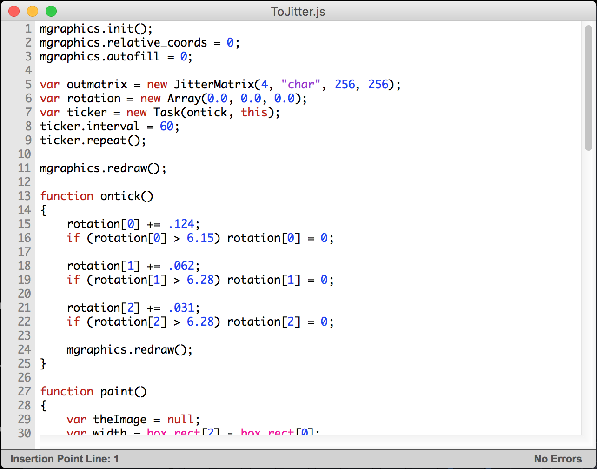

Synthesis
============

Generator
-------------------------------
The generator is based on VSynth main waveform generator (see analog LZX generators) and it's normal controls.
It is possible to choose the type of wave from Sine, Triangular, Ramp, Square and full Noise. Some controls are provided such as frequency and time.
Also some of the mixer effects might be included for pre-processing.

.. image:: images/interface8.png
    :align: center

.. image:: images/interface29.png
    :align: center

VC
-------------------------------
The VC is short for Voltage Control and works with 2 signals at the same time if the user wants. To merge more will be needed another module. 

.. image:: images/interface9.png
    :align: center

Tempo
-------------------------------
Good for creating entrainment.

.. image:: images/interface10.png
    :align: center

JS
-------------------------------
JS is a module that allows the user to use javascript m.graphics() to graw directly to the mapping environment. It is provided an example for the user to test.
It is possible to load external js files (need some specific functions to work).

.. image:: images/interface11.png
    :align: center

Loadpatch
-------------------------------
"loadpatch" allows the user to load external .maxpat files, Externals and Apps into the window of this module one can even scroll through the patch with an offset connection.
Be sure that the patch loaded is in presentation mode. Also, it will be connected directly by Out[0] to the main out of this module. 

.. image:: images/interface12.png
    :align: center

.. image:: images/interface31.png
    :align: center

Edge
-------------------------------
Simple edge detector.

Trace
-------------------------------
Based on matrix tracing from VIZZIE.

.. image:: images/interface14.png
    :align: center
